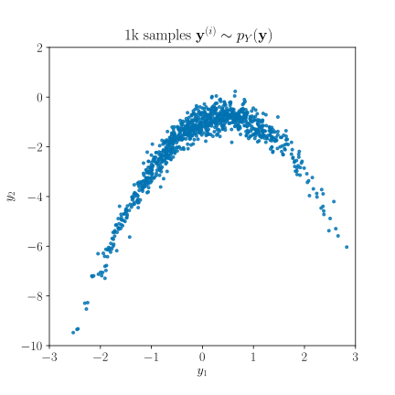
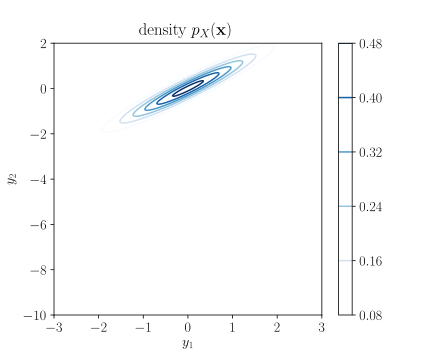
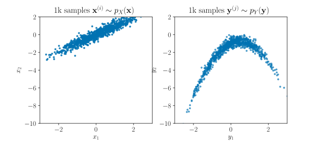
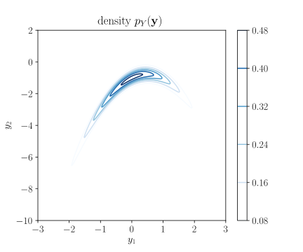

---
aliases:
  - /post/building-probability-distributions-with-tensorflow-probability-bijector-api/
title: Building Probability Distributions with the TensorFlow Probability Bijector API
summary: We illustrate how to build complicated probability distributions in a modular fashion using the Bijector API from TensorFlow Probability.
authors:
- me
tags:
- Probability Theory
- TensorFlow Probability
- TensorFlow
- Machine Learning
- Probabilistic Models
categories:
- technical
date: 2018-07-30
draft: false
math: true
---

TensorFlow Distributions, now under the broader umbrella of 
[TensorFlow Probability], is a fantastic TensorFlow library for efficient and 
composable manipulation of probability distributions[^dillon2017tensorflow].

Among the many features it has to offer, one of the most powerful in my opinion
is the `Bijector` API, which provide the modular building blocks necessary to
construct a broad class of probability distributions. 
Instead of describing it any further in the abstract, let's dive right in with 
a simple example.

## Example: Banana-shaped distribution

Consider the *banana-shaped distribution*, a commonly-used testbed for adaptive 
MCMC methods[^haario1999adaptive]. 
Denote the density of this distribution as $p_{Y}(\mathbf{y})$.
To illustrate, 1k samples randomly drawn from this distribution are shown below:



The underlying process that generates samples 
$\tilde{\mathbf{y}} \sim p\_{Y}(\mathbf{y})$ is simple to describe, 
and is of the general form,

$$
\tilde{\mathbf{y}} \sim p\_{Y}(\mathbf{y}) \quad 
\Leftrightarrow \quad 
\tilde{\mathbf{y}} = G(\tilde{\mathbf{x}}), 
\quad \tilde{\mathbf{x}} \sim p\_{X}(\mathbf{x}).
$$

In other words, a sample $\tilde{\mathbf{y}}$ is the output of a transformation
$G$, given a sample $\tilde{\mathbf{x}}$ drawn from some underlying
base distribution $p\_{X}(\mathbf{x})$.

However, it is not as straightforward to compute an analytical expression for 
density $p\_{Y}(\mathbf{y})$. 
In fact, this is only possible if $G$ is a *differentiable* and *invertible* 
transformation (a *diffeomorphism*[^1]), and if there is an analytical 
expression for $p\_{X}(\mathbf{x})$. 

Transformations that fail to satisfy these conditions (which includes something 
as simple as a multi-layer perceptron with non-linear activations) give rise to 
*implicit distributions*, and will be the subject of many posts to come. 
But for now, we will restrict our attention to diffeomorphisms.

### Base distribution

Following on with our example, the base distribution $p_{X}(\mathbf{x})$ is 
given by a two-dimensional Gaussian with unit variances and covariance 
$\rho = 0.95$:

$$
p_{X}(\mathbf{x}) = \mathcal{N}(\mathbf{x} | \mathbf{0}, \mathbf{\Sigma}),
\qquad
\mathbf{\Sigma} = 
\begin{bmatrix}
  1    & 0.95 \newline
  0.95 & 1
\end{bmatrix}
$$

This can be encapsulated by an instance of
[MultivariateNormalTriL](https://www.tensorflow.org/api_docs/python/tf/contrib/distributions/MultivariateNormalTriL), 
which is parameterized by a lower-triangular matrix.
First let's import TensorFlow Distributions:

```python
import tensorflow.contrib.distributions as tfd
```

Then we create the lower-triangular matrix and the instantiate the distribution:

```python
>>> rho = 0.95
>>> Sigma = np.float32(np.eye(N=2) + rho * np.eye(N=2)[::-1])
>>> Sigma
array([[1.  , 0.95],
       [0.95, 1.  ]], dtype=float32)
>>> p_x = tfd.MultivariateNormalTriL(scale_tril=tf.cholesky(Sigma))
```

As with all subclasses of `tfd.Distribution`, we can evaluated the probability 
density function of this distribution by calling the `p_x.prob` method. 
Evaluating this on an uniformly-spaced grid yields the equiprobability contour 
plot below:



### Forward Transformation

The required transformation $G$ is defined as:

$$
G(\mathbf{x}) =
\begin{bmatrix}
  x_1 \newline 
  x_2 - x_1^2 - 1 \newline 
\end{bmatrix}
$$

We implement this in the `_forward` function below[^2]:

```python
def _forward(x):

    y_0 = x[..., 0:1]
    y_1 = x[..., 1:2] - y_0**2 - 1
    y_tail = x[..., 2:-1]

    return tf.concat([y_0, y_1, y_tail], axis=-1)
```

We can now use this to generate samples from $p\_{Y}(\mathbf{y})$. 
To do this we first sample from the base distribution $p\_{X}(\mathbf{x})$ by 
calling `p_x.sample`. For this illustration, we generate 1k samples, which is 
specified through the `sample_shape` argument. We then transform these samples 
through $G$ by calling `_forward` on them.

```python
>>> x_samples = p_x.sample(1000)
>>> y_samples = _forward(x_samples)
```

The figure below contains scatterplots of the 1k samples `x_samples` (left) 
and the transformed `y_samples` (right):



### Instantiating a `TransformedDistribution` with a `Bijector`

Having specified the forward transformation and the underlying distribution, we 
have now fully described the sample generation process, which is the bare 
minimum necessary to define a probability distribution. 

The forward transformation is also the *first* of **three** operations needed to 
fully specify a `Bijector`, which can be used to instantiate a 
`TransformedDistribution` that encapsulates the banana-shaped distribution.

#### Creating a `Bijector`

First, let's subclass `Bijector` to define the `Banana` bijector and implement
the forward transformation as an instance method:

```python
class Banana(tfd.bijectors.Bijector):

    def __init__(self, name="banana"):
        super(Banana, self).__init__(inverse_min_event_ndims=1,
                                     name=name)

    def _forward(self, x):

        y_0 = x[..., 0:1]
        y_1 = x[..., 1:2] - y_0**2 - 1
        y_tail = x[..., 2:-1]

        return tf.concat([y_0, y_1, y_tail], axis=-1)
```

Note that we need to specify either `forward_min_event_ndims` or 
`inverse_min_event_ndims`, the number of dimensions the forward or inverse 
transformation operate on (which can sometimes differ).
In our example, both the inverse and forward transformation operate on vectors
(rank 1 tensors), so we set `inverse_min_event_ndims=1`.

With an instance of the `Banana` bijector, we can call the `forward` method on 
`x_samples` to produce `y_samples` as before:

```python
>>> y_samples = Banana().forward(x_samples)
```

#### Instantiating a `TransformedDistribution`

More importantly, we can now create a `TransformedDistribution` with the base 
distribution `p_x` and an instance of the `Banana` bijector:

```python
>>> p_y = tfd.TransformedDistribution(distribution=p_x, bijector=Banana())
```

This now allows us to directly sample from `p_y` just as we could with `p_x`, 
and any other TensorFlow Probability `Distribution`:

```python
>>> y_samples = p_y.sample(1000)
```

Neat!

### Probability Density Function

Although we can now sample from this distribution, we have yet to define the 
operations necessary to evaluate its probability density function---the 
remaining *two* of **three** operations needed to fully specify a `Bijector`

Indeed, calling `p_y.prob` at this stage would simply raise a 
`NotImplementedError` exception. So what else do we need to define? 

Recall the probability density of $p\_{Y}(\mathbf{y})$ is given by:

$$
p\_{Y}(\mathbf{y}) = p\_{X}(G^{-1}(\mathbf{y})) \mathrm{det} 
\left ( \frac{\partial}{\partial\mathbf{y}} G^{-1}(\mathbf{y}) \right )
$$

Hence we need to specify the inverse transformation $G^{-1}(\mathbf{y})$ and its
Jacobian determinant 
$\mathrm{det} \left ( \frac{\partial}{\partial\mathbf{y}} G^{-1}(\mathbf{y}) \right )$. 

For numerical stability, the `Bijector` API requires that this be defined in 
log-space. Hence, it is useful to recall that the forward and inverse log 
determinant Jacobians differ only in their signs[^3],

$$
\begin{align}
  \log \mathrm{det} \left ( \frac{\partial}{\partial\mathbf{y}} G^{-1}(\mathbf{y}) \right ) 
  & = - \log \mathrm{det} \left ( \frac{\partial}{\partial\mathbf{x}} G(\mathbf{x}) \right ),
\end{align}
$$

which gives us the option of implementing either (or both).
However, do note the following from the official 
[tf.contrib.distributions.bijectors.Bijector] API docs:

> Generally its preferable to directly implement the inverse Jacobian 
determinant. This should have superior numerical stability and will often share 
subgraphs with the `_inverse` implementation.

### Inverse Transformation

So let's implement the inverse transform $G^{-1}$, which is given by:

$$
G^{-1}(\mathbf{y}) =
\begin{bmatrix}
  y_1 \newline 
  y_2 + y_1^2 + 1 \newline 
\end{bmatrix}
$$

We define this in the `_inverse` function below:

```python
def _inverse(y):

    x_0 = y[..., 0:1]
    x_1 = y[..., 1:2] + x_0**2 + 1
    x_tail = y[..., 2:-1]

    return tf.concat([x_0, x_1, x_tail], axis=-1)
```

### Jacobian determinant

Now we compute the log determinant of the Jacobian of the *inverse* 
transformation. 
In this simple example, the transformation is *volume-preserving*, meaning its 
Jacobian determinant is equal to 1.

This is easy to verify:

$$
\begin{align}
  \mathrm{det} \left ( \frac{\partial}{\partial\mathbf{y}} G^{-1}(\mathbf{y}) \right ) 
  & = \mathrm{det}
  \begin{pmatrix}
    \frac{\partial}{\partial y_1} y_1             & \frac{\partial}{\partial y_2} y_1 \newline 
    \frac{\partial}{\partial y_1} y_2 + y_1^2 + 1 & \frac{\partial}{\partial y_2} y_2 + y_1^2 + 1 \newline 
  \end{pmatrix} \newline
  & = \mathrm{det}
  \begin{pmatrix}
    1     & 0 \newline 
    2 y_1 & 1 \newline 
  \end{pmatrix}
  = 1
\end{align}
$$

Hence, the log determinant Jacobian is given by zeros shaped like input `y`, up 
to the last `inverse_min_event_ndims=1` dimensions:

```python
def _inverse_log_det_jacobian(y):

    return tf.zeros(shape=y.shape[:-1])
```

Since the log determinant Jacobian is constant, i.e. independent of the input, 
we can just specify it for one input by setting the flag `is_constant_jacobian=True`[^4],
and the `Bijector` class will handle the necessary shape inference for us.

Putting it all together in the `Banana` bijector subclass, we have:

```python
class Banana(tfd.bijectors.Bijector):

    def __init__(self, name="banana"):
        super(Banana, self).__init__(inverse_min_event_ndims=1,
                                     is_constant_jacobian=True,
                                     name=name)

    def _forward(self, x):

        y_0 = x[..., 0:1]
        y_1 = x[..., 1:2] - y_0**2 - 1
        y_tail = x[..., 2:-1]

        return tf.concat([y_0, y_1, y_tail], axis=-1)

    def _inverse(self, y):

        x_0 = y[..., 0:1]
        x_1 = y[..., 1:2] + x_0**2 + 1
        x_tail = y[..., 2:-1]

        return tf.concat([x_0, x_1, x_tail], axis=-1)

    def _inverse_log_det_jacobian(self, y):

        return tf.zeros(shape=())
```

Finally, we can instantiate distribution `p_y` by calling 
`tfd.TransformedDistribution` as we did before *et voilà*,
we can now simply call `p_y.prob` to evaluate the probability density function.

Evaluating this on the same uniformly-spaced grid as before yields the following 
equiprobability contour plot:



#### Inline Bijector

Before we conclude, we note that instead of creating a subclass, one can also 
opt for a more lightweight and functional approach by creating an 
[Inline](https://www.tensorflow.org/api_docs/python/tf/contrib/distributions/bijectors/Inline) 
bijector:

```python
banana = tfd.bijectors.Inline(
    forward_fn=_forward, 
    inverse_fn=_inverse,
    inverse_log_det_jacobian_fn=_inverse_log_det_jacobian,
    inverse_min_event_ndims=1,
    is_constant_jacobian=True,
)
p_y = tfd.TransformedDistribution(distribution=p_x, bijector=banana)
```

<!-- ### Swiss roll distribution

$$
\begin{align}
  y_1 & = r \cos x_1 \newline
  y_2 & = r \sin x_1
\end{align}
$$

where

$$
r = a x_1 + b x_2
$$

for $a = \frac{2}{5}$ and $b = 1$


for $x_1$ in range 5 to 10 and $x_2 = 0$ 

### Pinwheel distribution -->

# Summary

In this post, we showed that using diffeomorphisms---mappings that are 
differentiable and invertible, it is possible transform standard distributions 
into interesting and complicated distributions, while still being able to 
compute their densities analytically.

The `Bijector` API provides an interface that encapsulates the basic properties
of a diffeomorphism needed to transform a distribution. These are: the 
forward transform itself, its inverse and the determinant of their Jacobians.

Using this, `TransformedDistribution` *automatically* implements perhaps the two 
most important methods of a probability distribution: sampling (`sample`), and 
density evaluation (`prob`).

Needless to say, this is a very powerful combination. 
Through the `Bijector` API, the number of possible distributions that can be 
implemented and used directly with other functionalities in the TensorFlow 
Probability ecosystem effectively becomes *endless*.

<!-- And I haven't even mentioned the fact that you can easily *parameterize* and 
*compose* `Bijector`s to implement *normalizing flows* such as the 
*autoregressive flows*!
 -->

---

Cite as:

```
@article{tiao2018bijector,
  title   = "{B}uilding {P}robability {D}istributions with the {T}ensor{F}low {P}robability {B}ijector {API}",
  author  = "Tiao, Louis C",
  journal = "tiao.io",
  year    = "2018",
  url     = "https://tiao.io/post/building-probability-distributions-with-tensorflow-probability-bijector-api/"
}
```

To receive updates on more posts like this, follow me on [Twitter] and [GitHub]!

[Twitter]: https://twitter.com/louistiao
[GitHub]: https://github.com/ltiao

## Links & Resources

- Try this out yourself in a [Colaboratory Notebook](https://colab.research.google.com/gist/ltiao/c135b1cdddf93790ed1f6eb201132dcf/tensorflow-bijector-api-banana-shaped-distribution.ipynb).
- Paper: see footnote[^dillon2017tensorflow]
- Blog Post: [Introducing TensorFlow Probability](https://medium.com/tensorflow/introducing-tensorflow-probability-dca4c304e245)
- API Documentation: [tf.contrib.distributions.bijectors.Bijector] 

[TensorFlow Probability]: https://medium.com/tensorflow/introducing-tensorflow-probability-dca4c304e245
[tf.contrib.distributions.bijectors.Bijector]: https://www.tensorflow.org/api_docs/python/tf/contrib/distributions/bijectors/Bijector

[^dillon2017tensorflow]: Dillon, J.V., Langmore, I., Tran, D., Brevdo, E., Vasudevan, S., Moore, D., Patton, B., Alemi, A., Hoffman, M. and Saurous, R.A., 2017. *TensorFlow Distributions.* [arXiv preprint arXiv:1711.10604](https://arxiv.org/abs/1711.10604).
[^haario1999adaptive]: Haario, H., Saksman, E., & Tamminen, J. (1999). [Adaptive proposal distribution for random walk Metropolis algorithm](https://www.researchgate.net/profile/Heikki_Haario/publication/2762543_Adaptive_Proposal_Distribution_for_Random_Walk_Metropolis_Algorithm/links/02e7e528e1325cb270000000/Adaptive-Proposal-Distribution-for-Random-Walk-Metropolis-Algorithm.pdf). *Computational Statistics*, 14(3), 375-396.

[^1]: for the transformation to be a diffeomorphism, it also needs to be *smooth*.
[^2]: we implement this for the general case of $K \geq 2$ dimensional inputs since this actually turns out to be easier and cleaner (a phenomenon known as [Inventor's paradox](https://en.wikipedia.org/wiki/Inventor%27s_paradox)).
[^3]: 
    this is a straightforward consequence of the 
    [inverse function theorem](https://en.wikipedia.org/wiki/Inverse_function_theorem) 
    which says the matrix inverse of the Jacobian of $G$ is the Jacobian of 
    its inverse $G^{-1}$,
    $$
    \frac{\partial}{\partial\mathbf{y}} G^{-1}(\mathbf{y}) = 
    \left ( \frac{\partial}{\partial\mathbf{x}} G(\mathbf{x}) \right )^{-1}
    $$
    Taking the determinant of both sides, we get:
    $$
    \begin{align}
      \mathrm{det} \left ( \frac{\partial}{\partial\mathbf{y}} G^{-1}(\mathbf{y}) \right ) 
      & = \mathrm{det} \left ( \left ( \frac{\partial}{\partial\mathbf{x}} G(\mathbf{x}) \right )^{-1} \right ) \newline
      & = \mathrm{det} \left ( \frac{\partial}{\partial\mathbf{x}} G(\mathbf{x}) \right )^{-1}
    \end{align}
    $$
    as required.
[^4]: See description of [is_constant_jacobian](https://www.tensorflow.org/api_docs/python/tf/contrib/distributions/bijectors/Bijector#is_constant_jacobian) argument for further details.
