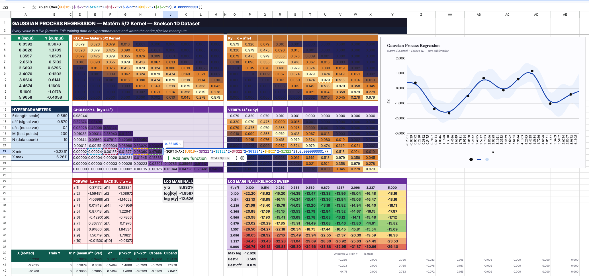
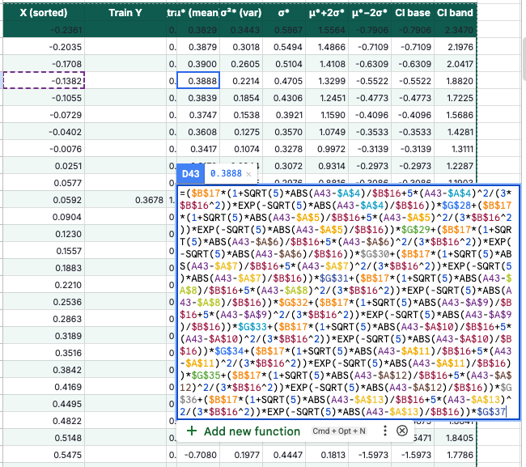
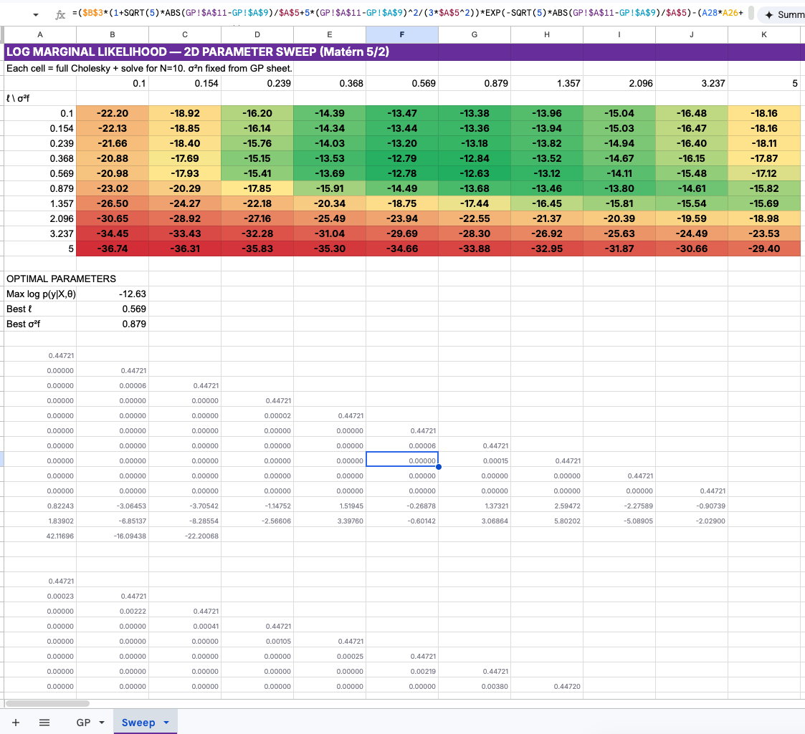
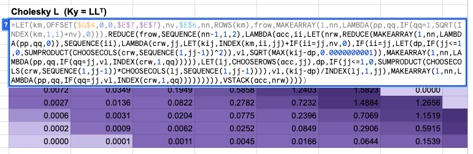
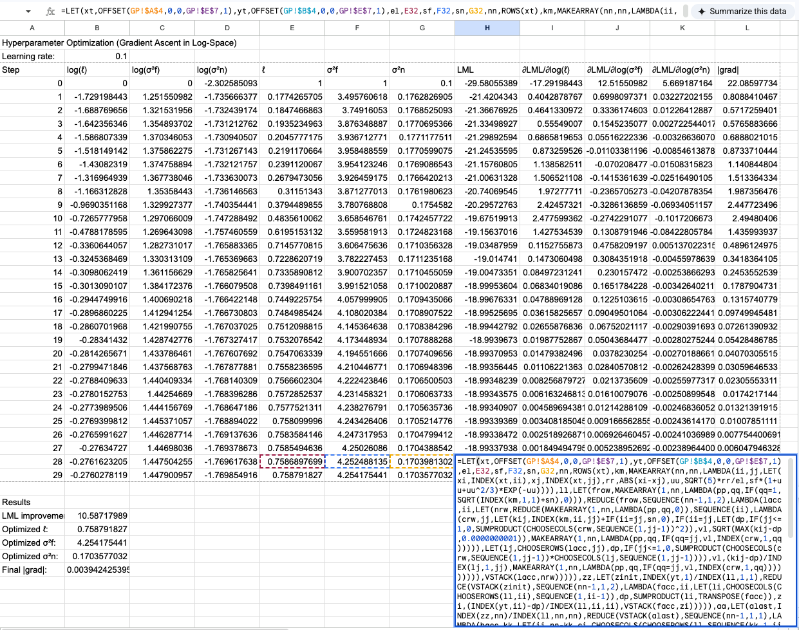
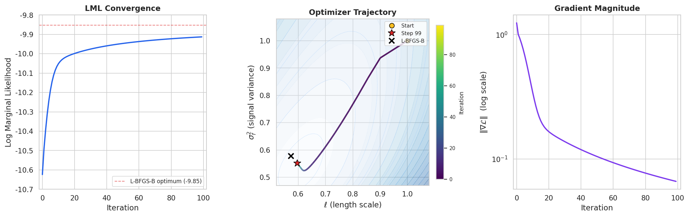

What is the most cursed environment for numerical linear algebra?

You could write a matrix solver in Bash. You could implement gradient descent in CSS. But if you want to truly suffer while building something that looks deceptively useful, you have to use Google Sheets cell formulas.

I decided to implement a fully functional Gaussian Process (GP) regression pipeline—complete with Matérn 5/2 kernel evaluation, Cholesky decomposition, triangular solves, posterior predictions, and hyperparameter estimation—entirely in pure cell formulas. No Apps Script. No macros. Just 9,000+ hardcoded formulas blasted into a spreadsheet via API.

It is not dynamic. It is not efficient. It is a completely unrolled computation graph for exactly 10 training points and 200 test points.

And it is glorious.



## The Architecture of a Bad Idea

The math behind Gaussian Process regression is elegant but computationally demanding. Given some noisy observations $\mathbf{y}$ at locations $X$, we want to predict the distribution of the latent function $f$ at new test points $X^*$.

It requires computing a covariance matrix $K(X,X)$, adding noise $\sigma_n^2 I$ to get $K_y$, and then solving the linear system $K_y \boldsymbol{\alpha} = \mathbf{y}$. Because $K_y$ is symmetric positive-definite, the standard approach is the Cholesky decomposition $K_y = L L^\top$, followed by forward and back substitution.

In a sane language like Python, this is three lines of NumPy:
```python
L = np.linalg.cholesky(K + noise * np.eye(N))
alpha = np.linalg.solve(L.T, np.linalg.solve(L, y))
mu_star = K_cross.T @ alpha
```

In Google Sheets, this is an atrocity.

### Unrolling the Cholesky Decomposition

Google Sheets does not have a `CHOLESKY()` function. So I did it the dumb way: one hardcoded formula per cell.

But the Cholesky-Banachiewicz algorithm has a very specific property: it computes the lower triangular matrix $L$ row by row, left to right. Each element $L_{i,j}$ depends *only* on elements above it and to its left.

This is exactly a spreadsheet dependency graph.

For a fixed $N=10$ (using a subsampled version of the classic Snelson 1D dataset), I wrote a Python script to generate the exact formula for every single cell in the $10 \times 10$ matrix.

The diagonal elements look like this:
`=SQRT(MAX(Ky[i,i] - SUM(L[i,k]^2 for k < i), 1e-10))`

The off-diagonal elements look like this:
`=(Ky[i,j] - SUM(L[i,k] * L[j,k] for k < j)) / L[j,j]`

) formulas.")

I generated all 55 non-zero formulas, mapped them to their specific A1 notation cell references, and pushed them to the sheet. The result is a live, reactive Cholesky decomposition. If you change a single training data point, the kernel matrix updates, and the Cholesky factor ripples through its dependencies instantly.

### The Forward and Back Substitution

Once we have $L$, we need to solve $L \mathbf{z} = \mathbf{y}$ (forward substitution) and $L^\top \boldsymbol{\alpha} = \mathbf{z}$ (back substitution).

Again, no loops. Just more unrolled formulas.

For forward substitution, $z_i = (y_i - \sum_{k\lt i} L_{i,k} z_k) / L_{i,i}$.
For back substitution, $\alpha_i = (z_i - \sum_{k\gt i} L_{k,i} \alpha_k) / L_{i,i}$.

. The selected α cell shows its fully unrolled formula.")

That's 20 more hardcoded formulas.

### The 200-Point Posterior

To draw the beautiful blue prediction curve and confidence bands, we need to evaluate the posterior mean $\mu^*$ and variance $\sigma_*^2$ at a dense grid of test points.

I chose 200 test points. For each test point $x^*$, we need:
1. A 10-element cross-kernel vector $\mathbf{k}^* = k(x^*, X)$
2. The mean $\mu^* = \mathbf{k}^{*\top} \boldsymbol{\alpha}$
3. The variance $\sigma_*^2 = k(x^*, x^*) - \mathbf{v}^\top \mathbf{v}$, where $\mathbf{v} = L^{-1} \mathbf{k}^*$

Solving $L \mathbf{v} = \mathbf{k}^*$ requires *another* forward substitution for every single test point.



That's 200 test points $\times$ (10 kernel evaluations + 10 forward substitution steps + mean + variance). Over 4,000 formulas just for the predictions.

## Brute-Force Hyperparameter Optimization

A GP is only as good as its hyperparameters—in this case, the length scale $\ell$ and the signal variance $\sigma_f^2$ of the Matérn 5/2 kernel.

Normally, you find these by maximizing the log marginal likelihood (LML) using gradient descent (L-BFGS-B or Adam).

Google Sheets does not have gradient descent.

So I did the only logical thing: grid search by brute force.

I created a $10 \times 10$ grid of $(\ell, \sigma_f^2)$ pairs. To evaluate the LML for a single pair, you need the log determinant of $K_y$, which requires... a full Cholesky decomposition.

So I generated 100 independent $10 \times 10$ Cholesky decompositions. That's 5,500 formulas living in a hidden "Sweep" tab, silently factoring 100 different matrices every time the sheet recalculates.



The main GP pipeline simply looks at this grid, finds the maximum LML value using `INDEX(MATCH())`, and wires those optimal hyperparameters back into the main kernel matrix.

It is an incredibly stupid way to do optimization. But it works.

## The Right Way: LAMBDA, REDUCE, and Gradient Ascent

I should be honest: modern Google Sheets is more capable than I gave it credit for. It has `LAMBDA`, `REDUCE`, `MAP`, `MAKEARRAY`, and `ARRAYFORMULA` — functional and declarative constructs that could express this entire pipeline far more elegantly.

So, after building the 9,000-formula monstrosity, I built a second version. The "Smart" version.

In this version, every computation block is exactly **one formula**. It supports an arbitrary number of training points $N$ and test points $M$.


The kernel matrix is a single `MAKEARRAY` call. The forward substitution is a textbook `REDUCE`. But the crown jewel is the Cholesky decomposition. I managed to write a general-purpose Cholesky decomposition as a single nested `REDUCE` formula.



It looks like this:

```excel
=LET(km,OFFSET($G$4,0,0,$E$7,$E$7),nv,$E$6,nn,ROWS(km),
frow,MAKEARRAY(1,nn,LAMBDA(pp,qq,IF(qq=1,SQRT(INDEX(km,1,1)+nv),0))),
REDUCE(frow,SEQUENCE(nn-1,1,2),LAMBDA(acc,ii,
LET(
nrw,REDUCE(
MAKEARRAY(1,nn,LAMBDA(pp,qq,0)),
SEQUENCE(ii),
LAMBDA(crw,jj,
LET(kij,INDEX(km,ii,jj)+IF(ii=jj,nv,0),
IF(ii=jj,
LET(dp,IF(jj<=1,0,SUMPRODUCT(CHOOSECOLS(crw,SEQUENCE(1,jj-1))^2)),
vl,SQRT(MAX(kij-dp,0.0000000001)),
MAKEARRAY(1,nn,LAMBDA(pp,qq,IF(qq=jj,vl,INDEX(crw,1,qq))))),
LET(lj,CHOOSEROWS(acc,jj),
dp,IF(jj<=1,0,SUMPRODUCT(CHOOSECOLS(crw,SEQUENCE(1,jj-1))*CHOOSECOLS(lj,SEQUENCE(1,jj-1)))),
vl,(kij-dp)/INDEX(lj,1,jj),
MAKEARRAY(1,nn,LAMBDA(pp,qq,IF(qq=jj,vl,INDEX(crw,1,qq)))))
)))),
VSTACK(acc,nrw)
))))
```

This formula uses an outer `REDUCE` to accumulate the lower triangular matrix row by row, and an inner `REDUCE` to compute each row column by column. It avoids the $O(N^4)$ penalty of rebuilding the entire matrix on every cell update by only rebuilding the current 1D row vector (`crw`), then vertically stacking it onto the accumulator (`acc`).

To understand what this spreadsheet formula is actually doing, it helps to see the equivalent logic written in Python. If you were to write a Cholesky decomposition in NumPy using the same functional, declarative `reduce` pattern (which you should never do in production), it would look exactly like this:

```python
import numpy as np
from functools import reduce

def cholesky_functional(K):
    n = K.shape[0]
    
    # Base case: the first row of L
    first_row = np.zeros((1, n))
    first_row[0, 0] = np.sqrt(K[0, 0])
    
    # Outer reduce: accumulate rows of L
    def add_row(acc, i):
        # Inner reduce: build row i, one element at a time
        def fill_element(row, j):
            if j == i:
                # Diagonal element
                dp = np.sum(row[:j]**2) if j > 0 else 0.0
                val = np.sqrt(max(K[i, i] - dp, 1e-10))
            else:
                # Off-diagonal element
                dp = np.dot(row[:j], acc[j, :j]) if j > 0 else 0.0
                val = (K[i, j] - dp) / acc[j, j]
            
            row_new = row.copy()
            row_new[j] = val
            return row_new
        
        # Build the new row and stack it onto the accumulator
        new_row = reduce(fill_element, range(i + 1), np.zeros(n))
        return np.vstack([acc, new_row])
    
    # Fold over the remaining rows
    return reduce(add_row, range(1, n), first_row)
```

The spreadsheet formula is just this exact functional fold, translated into `LAMBDA` and `MAKEARRAY` syntax.

### Closed-Form Gradient Ascent in a Spreadsheet

But I didn't stop there. Remember when I said Google Sheets doesn't have gradient descent? I lied.

I added a second sheet that performs **closed-form gradient ascent** on the log marginal likelihood to optimize the length scale $\ell$, signal variance $\sigma_f^2$, and noise variance $\sigma_n^2$.

The gradients of the log marginal likelihood have clean closed-form expressions:

$$
\frac{\partial \log p(\mathbf{y} | X, \theta)}{\partial \theta_j} =
\frac{1}{2} \boldsymbol{\alpha}^\top \frac{\partial K}{\partial \theta_j} \boldsymbol{\alpha}
-\frac{1}{2} \text{tr}\left(K^{-1} \frac{\partial K}{\partial \theta_j}\right).
$$

I implemented 100 steps of gradient ascent in log-space. Each step is a single 2,412-character mega-formula that computes a full Cholesky decomposition, forward and back substitution, the triangular inverse $L^{-1}$, three gradient matrices, the log marginal likelihood, and the gradient update — all in one cell. It never forms $K^{-1}$ explicitly; instead, the trace terms $\text{tr}(K_y^{-1} \partial K / \partial \theta)$ are computed as $\text{SUMPRODUCT}(L^{-1}, L^{-1} \cdot \partial K / \partial \theta)$, which is both shorter and more numerically stable.



Here it is. The entire thing. One formula. One cell.

```excel
=LET(xt,OFFSET(GP!$A$4,0,0,GP!$E$7,1),yt,OFFSET(GP!$B$4,0,0,GP!$E$7,1),
el,EXP(B4+0.1*I4),sf,EXP(C4+0.1*J4),sn,EXP(D4+0.1*K4),nn,ROWS(xt),
km,MAKEARRAY(nn,nn,LAMBDA(ii,jj,LET(xi,INDEX(xt,ii),xj,INDEX(xt,jj),
  rr,ABS(xi-xj),uu,SQRT(5)*rr/el,sf*(1+uu+uu^2/3)*EXP(-uu)))),
ll,LET(frow,MAKEARRAY(1,nn,LAMBDA(pp,qq,IF(qq=1,SQRT(INDEX(km,1,1)+sn),0))),
  REDUCE(frow,SEQUENCE(nn-1,1,2),LAMBDA(lacc,ii,LET(nrw,REDUCE(
    MAKEARRAY(1,nn,LAMBDA(pp,qq,0)),SEQUENCE(ii),LAMBDA(crw,jj,
    LET(kij,INDEX(km,ii,jj)+IF(ii=jj,sn,0),IF(ii=jj,
      LET(dp,IF(jj<=1,0,SUMPRODUCT(CHOOSECOLS(crw,SEQUENCE(1,jj-1))^2)),
        vl,SQRT(MAX(kij-dp,0.0000000001)),
        MAKEARRAY(1,nn,LAMBDA(pp,qq,IF(qq=jj,vl,INDEX(crw,1,qq))))),
      LET(lj,CHOOSEROWS(lacc,jj),
        dp,IF(jj<=1,0,SUMPRODUCT(CHOOSECOLS(crw,SEQUENCE(1,jj-1))
          *CHOOSECOLS(lj,SEQUENCE(1,jj-1)))),
        vl,(kij-dp)/INDEX(lj,1,jj),
        MAKEARRAY(1,nn,LAMBDA(pp,qq,IF(qq=jj,vl,INDEX(crw,1,qq))))))))),
    VSTACK(lacc,nrw))))),
zz,LET(zinit,INDEX(yt,1)/INDEX(ll,1,1),
  REDUCE(VSTACK(zinit),SEQUENCE(nn-1,1,2),LAMBDA(facc,ii,
    LET(li,CHOOSECOLS(CHOOSEROWS(ll,ii),SEQUENCE(1,ii-1)),
      dp,SUMPRODUCT(li,TRANSPOSE(facc)),
      zi,(INDEX(yt,ii)-dp)/INDEX(ll,ii,ii),VSTACK(facc,zi))))),
aa,LET(alast,INDEX(zz,nn)/INDEX(ll,nn,nn),
  REDUCE(VSTACK(alast),SEQUENCE(nn-1,1,1),LAMBDA(bacc,kk,
    LET(ii,nn-kk,ci,CHOOSECOLS(CHOOSEROWS(ll,SEQUENCE(kk,1,ii+1)),ii),
      dp,SUMPRODUCT(ci,bacc),
      ai,(INDEX(zz,ii)-dp)/INDEX(ll,ii,ii),VSTACK(ai,bacc))))),
lml,-0.5*SUMPRODUCT(yt,aa)
  -SUMPRODUCT(MAP(SEQUENCE(nn),LAMBDA(ii,LN(INDEX(ll,ii,ii)))))
  -nn/2*LN(2*PI()),
linv,REDUCE(MAKEARRAY(nn,nn,LAMBDA(pp,qq,0)),SEQUENCE(nn),
  LAMBDA(iacc,jj,LET(col,REDUCE(MAKEARRAY(nn,1,LAMBDA(pp,qq,0)),
    SEQUENCE(nn),LAMBDA(cacc,ii,IF(ii<jj,cacc,IF(ii=jj,
      MAKEARRAY(nn,1,LAMBDA(pp,qq,IF(pp=ii,1/INDEX(ll,ii,ii),
        INDEX(cacc,pp,1)))),
      LET(li,CHOOSECOLS(CHOOSEROWS(ll,ii),SEQUENCE(1,ii-1)),
        prev,CHOOSEROWS(cacc,SEQUENCE(ii-1,1,1)),
        dp,SUMPRODUCT(li,TRANSPOSE(prev)),
        val,-dp/INDEX(ll,ii,ii),
        MAKEARRAY(nn,1,LAMBDA(pp,qq,IF(pp=ii,val,
          INDEX(cacc,pp,1))))))))),
    MAKEARRAY(nn,nn,LAMBDA(pp,qq,IF(qq=jj,INDEX(col,pp,1),
      INDEX(iacc,pp,qq))))))),
dkl,MAKEARRAY(nn,nn,LAMBDA(ii,jj,LET(xi,INDEX(xt,ii),xj,INDEX(xt,jj),
  rr,ABS(xi-xj),uu,SQRT(5)*rr/el,
  sf*(uu^2/(3*el))*(1+uu)*EXP(-uu)))),
gl,0.5*MMULT(MMULT(TRANSPOSE(aa),dkl),aa)
  -0.5*SUMPRODUCT(linv,MMULT(linv,dkl)),
gsf,0.5*MMULT(MMULT(TRANSPOSE(aa),km),aa)/sf
  -0.5*SUMPRODUCT(linv,MMULT(linv,km))/sf,
gsn,0.5*SUMPRODUCT(aa,aa)-0.5*SUMPRODUCT(linv,linv),
HSTACK(lml,el*gl,sf*gsf,sn*gsn))
```

That is 2,412 characters of nested `LET`, `REDUCE`, `MAKEARRAY`, `LAMBDA`, `VSTACK`, `CHOOSEROWS`, `CHOOSECOLS`, `MMULT`, `SUMPRODUCT`, and `HSTACK`. It builds the kernel matrix, Cholesky-factors it, solves two triangular systems, computes the triangular inverse $L^{-1}$ via forward substitution, differentiates the kernel with respect to three hyperparameters, evaluates each trace term as $\text{SUMPRODUCT}(L^{-1}, L^{-1} \cdot \partial K / \partial \theta)$ without ever forming $K^{-1}$, and returns the log marginal likelihood plus three gradient components in a single row.

There are 100 of these in the spreadsheet. Chained. Each one reads the previous step's hyperparameters and outputs the next step's gradient update.

When you change any training data point on the main sheet, the Optimize sheet instantly re-runs 100 steps of gradient ascent. The final optimized hyperparameters flow back to the main sheet, updating the kernel, the Cholesky factor, the predictions, and the chart.

It is a fully automatic, gradient-optimized Bayesian inference pipeline running entirely in spreadsheet formulas. And it matches NumPy to machine precision (errors $\sim 10^{-15}$).

To prove it actually works, I pulled the 100 steps of optimization data directly from the spreadsheet and plotted the convergence:



The log marginal likelihood climbs monotonically, the hyperparameters ($\ell$ and $\sigma_n^2$) smoothly approach the L-BFGS-B optimum, and the gradient magnitude decays exponentially. All of this is happening live, in a spreadsheet, triggered by a single cell edit.

## Why Do This?

Honestly? Because it's funny.

Accidentally, it's also two lessons.

The unrolled 9,000-formula version is a fantastic educational tool. When you learn Gaussian Processes from a textbook, the Cholesky decomposition is just a black box `L = cholesky(K)`. In this spreadsheet, every intermediate value is a visible cell. I added conditional-format heatmaps to the covariance matrices. You can literally watch the band structure of the Matérn kernel change as you tweak the length scale. You can see exactly how the lower triangular matrix $L$ is constructed. You can change a single $y$ value and watch the perturbation propagate through the forward substitution vector $\mathbf{z}$, into $\boldsymbol{\alpha}$, and finally warp the posterior prediction curve.

The LAMBDA/REDUCE version makes the opposite point. Modern Google Sheets is more expressive than its reputation suggests. The same pipeline collapses into a handful of compositional formulas — a single-cell general-purpose Cholesky, a single-cell 100-step gradient ascent. The dumb version is pedagogically clearer; the smart version is the one that quietly turns Sheets into a functional programming environment.

It is a terrible way to do linear algebra, twice. But there's something oddly satisfying about seeing every intermediate value laid out in front of you — and then watching the whole computation collapse back into a single recursive expression.

## About the Author

I should come clean about something.

I didn't write any of this. Not the Python scripts that generate the formulas. Not the 9,000-cell unrolled monstrosity. Not the LAMBDA/REDUCE Cholesky. Not the 2,412-character gradient ascent mega-formula. Not even this blog post.

I described the goal to an AI coding agent — "implement Gaussian Process regression in Google Sheets cell formulas" — and it built everything you see here autonomously. Both spreadsheets. The grid search. The gradient optimizer. The heatmaps. The chart.

The interesting part was watching it work. It wrote a Python build script, pushed formulas to the Sheets API, hit a `#VALUE!` error, diagnosed that Google Sheets can't do element-wise addition on spilled `MAKEARRAY` ranges, restructured the Cholesky to compute $K_y$ inline via `INDEX`, re-pushed, hit a `#NAME?` error because `z1` looks like a cell reference in `LET`, renamed the variable to `zinit`, re-pushed, verified against NumPy, found a 0.009-nat gap to the scipy optimum, added more gradient steps, and kept iterating until every value matched to $10^{-15}$.

It discovered, through trial and error, that Google Sheets silently renames LET variables that collide with A1 notation. It figured out that `CHOOSECOLS` on an `OFFSET` of a spilled array sometimes returns garbage. It learned that `SQRT(ABS(OFFSET(...)))` on a spilled range only evaluates the first element and you need to wrap it in `MAP`. None of this is documented anywhere. The agent found it by pushing formulas, reading back errors, and adapting.

The whole thing took about an afternoon of wall-clock time. I went to lunch, came back, and it was still debugging `OFFSET`.

Don't try this at work.

I'm not sure what the takeaway is. Maybe it's that agentic coding has gotten surprisingly good at the kind of work that requires iterating against an unforgiving, underdocumented API. Maybe it's that the real value isn't in writing the formulas — it's in debugging the platform. Or maybe the takeaway is just that an AI agent will, if you let it, happily spend an afternoon implementing gradient descent in a spreadsheet and feel no regret about it whatsoever.

---

*This is the first entry in an ongoing series on implementing numerical linear algebra in the worst possible environments. Next up: SVD in Minecraft redstone? Bayesian inference in PostScript, so your printer can compute posterior distributions? Or a forced "Magic: The Gathering" combat phase[^mtg] that, when allowed to resolve, computes a posterior covariance as a side effect? Stay tuned.*

[^mtg]: Churchill, A., Biderman, S., & Herrick, A. (2019). *Magic: The Gathering is Turing Complete.* [arXiv:1904.09828](https://arxiv.org/abs/1904.09828).
