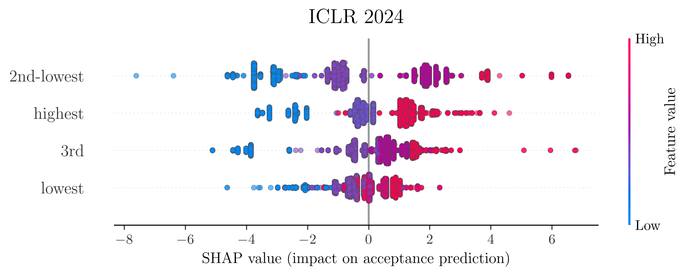

Two low scores on your ICLR paper is a death sentence. One bad review you can survive. Two, and it is over: about a one-in-fifty chance, no matter how enthusiastic your other reviewers are. The score that carries the most weight is not your worst review. It is your *second*-worst. I know this because ICLR publishes its rejections, and nine years of data say the same thing.

All three big ML conferences use OpenReview, so you might think all three publish their reviews. They do not. NeurIPS and ICML show the papers that got in and quietly remove the ones that did not, reviews included. Pull NeurIPS from OpenReview today and it looks like the conference accepts 95% of what it receives, because the only rejections still visible are the few that authors chose to un-hide. ICLR is the exception. It leaves rejected papers up, scores and reviews intact, thousands a year going back to 2018. I can only say your second-worst review predicts your fate about ICLR, because ICLR is the only one of the three that will show you the papers that lost.

The pattern holds across every version of the scoring rubric, and ICLR changed rubrics four times. Some years reviewers rated on a full 1-to-10 slider (2018, 2019, 2021). Other years it was a coarse ladder: 1, 3, 6, and 8 in 2020. From 2022 it was 1, 3, 5, 6, 8, and 10, with a single step of resolution between "marginally below the bar" and "marginally above." In 2026 the scale switched to even numbers, 0 through 10. Four score sheets in nine years. The second-worst effect shows up on all of them. It is not an artifact of the rubric, because the rubric kept changing and the effect did not.

Every ICLR 2024 paper with four reviewers, arranged by its two lowest scores (which panel) and its two highest (which square inside the panel), shaded by acceptance rate. These are final, post-rebuttal scores, so a paper in a doom cell is one whose rebuttal already failed to move its reviewers.

The red is what you notice first. That top-left corner is papers whose two lowest scores both landed on 3. It is a wall, and nothing to its right climbs out. Papers with just one 3 and a second-lowest of 6 or above accept at about 50% (n=108). Two 3s, no matter the top pair, accept at about 2% (n=338). The difference between one low score and two is the whole story.

Your instinct might be to point out that the mean score predicts better. It does. Logistic regression on the mean gives a cross-validated AUC of 0.94; the second-lowest alone gives 0.89. The mean uses all four scores, so it has more to work with. But the question is which of the four scores the prediction leans on most, not which summary statistic wins.

The four scores together predict acceptance at an AUC of 0.95 in held-out folds. I added 44 more features (soundness, presentation, contribution sub-scores, reviewer confidence, word count, question count, submission timing) and the AUC did not move. With 3,700 papers and correlated predictors, that is not proof those features carry zero signal, but it is worth noting.

Within those four, a decision tree splits at the root on the second-lowest score, at the 5/6 boundary. Logistic regression gives it the largest standardized coefficient (about double the min, triple the max). Permutation importance from random forest and gradient boosting agrees. Shapley values give s2 a mean absolute contribution of 2.06, compared to 1.17 for the max, 1.13 for the third, and 0.61 for the min. s2 is the single most important score for 58% of papers, the third score for 25%, the highest for 16%. The worst score, the one you are fixated on, is the most important for fewer than 2%. All four matter. s2 is first and s1 is last.

Why might the second-lowest carry so much weight? A single low score is a dissent, and area chairs see dissents constantly. They have ways to dismiss them: a reviewer who skimmed, a mismatch in taste, an off day. A second low score is harder to dismiss. Two readers arriving at the same place stops looking like bad luck. The veto needs a second. (This is speculation about AC behavior, not something the data proves. Reviewers see each other's scores during discussion, so the second low score is not necessarily independent of the first.)

The wall is stubborn. In 2024, the best-case rescue (two 3s and two 8s, n=6) stayed in the single digits. Across common score combinations with enough papers to measure, nothing with two floor-level scores climbs much higher. In 2026, on the new scale, two 2s with two 8s accepted at 25% (n=91), up from near-zero on older scales but still below the 2026 baseline of 39%. The wall shifts with the rubric but does not disappear.

Next time your scores land, skip the lowest one. Look at the one above it. That is the number that probably already sealed your paper's fate.
