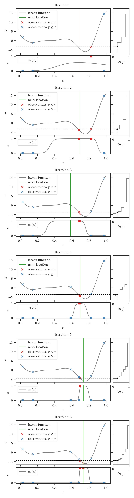

---
aliases:
  - /publication/bore-2/
title: 'BORE: Bayesian Optimization by Density-Ratio Estimation'

# Authors
# If you created a profile for a user (e.g. the default `admin` user), write the username (folder name) here
# and it will be replaced with their full name and linked to their profile.
authors:
  - me
  - Aaron Klein
  - Matthias Seeger
  - Edwin V. Bonilla
  - Cédric Archambeau
  - Fabio Ramos

date: '2021-05-08T00:00:00Z'
doi: ''
math: true

# Publication type.
# Legend: 0 = Uncategorized; 1 = Conference paper; 2 = Journal article;
# 3 = Preprint / Working Paper; 4 = Report; 5 = Book; 6 = Book section;
# 7 = Thesis; 8 = Patent
publication_types: ['paper-conference']

# Publication name and optional abbreviated publication name.
publication: Proceedings of the 38th International Conference on Machine Learning (ICML2021)
publication_short: In *ICML2021*. Accepted as *Long Presentation* (Awarded to Top 3% of Papers)

abstract: Bayesian optimization (BO) is among the most effective and widely-used blackbox optimization methods. BO proposes solutions according to an explore-exploit trade-off criterion encoded in an acquisition function, many of which are derived from the posterior predictive of a probabilistic surrogate model. Prevalent among these is the expected improvement (EI). Naturally, the need to ensure analytical tractability in the model poses limitations that can ultimately hinder the efficiency and applicability of BO. In this paper, we cast the computation of EI as a binary classification problem, building on the well-known link between class probability estimation (CPE) and density-ratio estimation (DRE), and the lesser-known link between density-ratios and EI. By circumventing the tractability constraints imposed on the model, this reformulation provides several natural advantages, not least in scalability, increased flexibility, and greater representational capacity.

# Summary. An optional shortened abstract.
summary: We reformulate the computation of the acquisition function in Bayesian optimization (BO) as a probabilistic classification problem, providing advantages in scalability, flexibility, and representational capacity, while casting aside the limitations of tractability constraints on the model.

tags:
  - Machine Learning
  - Probabilistic Models
  - Density Ratio Estimation
  - AutoML
  - Bayesian Optimization
  - Hyperparameter Optimization

# Display this page in the Featured widget?
featured: true

# Custom links (uncomment lines below)
# links:
# - name: Custom Link
#   url: http://example.org


# Featured image
# To use, add an image named `featured.jpg/png` to your page's folder.
image:
  caption: ''
  focal_point: Center
  preview_only: false

# Associated Projects (optional).
#   Associate this publication with one or more of your projects.
#   Simply enter your project's folder or file name without extension.
#   E.g. `internal-project` references `content/project/internal-project/index.md`.
#   Otherwise, set `projects: []`.
projects: []

# Slides (optional).
#   Associate this publication with Markdown slides.
#   Simply enter your slide deck's filename without extension.
#   E.g. `slides: "example"` references `content/slides/example/index.md`.
#   Otherwise, set `slides: ""`.
slides: ""

links:
- name: Conference Proceeding
  url: http://proceedings.mlr.press/v139/tiao21a.html
- name: Supplementary material
  url: http://proceedings.mlr.press/v139/tiao21a/tiao21a-supp.pdf
- type: pdf
  url: "http://proceedings.mlr.press/v139/tiao21a/tiao21a.pdf"
- type: code
  url: "https://github.com/ltiao/bore"
- type: poster
  url: "poster.pdf"
- type: slides
  url: "http://decks.tiao.io/bore-icml-2021/index.html"
- type: video
  url: "https://slideslive.com/38942425"
---

**B**ayesian **O**ptimization (BO) by Density-**R**atio **E**stimation (DRE), 
or **BORE**, is a simple, yet effective framework for the optimization of 
blackbox functions. 
BORE is built upon the correspondence between *expected improvement (EI)*---arguably 
the predominant *acquisition functions* used in BO---and the *density-ratio* 
between two unknown distributions.

One of the far-reaching consequences of this correspondence is that we can 
reduce the computation of EI to a *probabilistic classification* problem---a 
problem we are well-equipped to tackle, as evidenced by the broad range of 
streamlined, easy-to-use and, perhaps most importantly, battle-tested
tools and frameworks available at our disposal for applying a variety of approaches.
Notable among these are [Keras](https://keras.io/) / [TensorFlow](http://tensorflow.org/) and
[PyTorch Lightning](https://pytorchlightning.ai/) / [PyTorch](https://pytorch.org/) 
for Deep Learning, [XGBoost](https://xgboost.ai/) for Gradient Tree Boosting, 
not to mention [scikit-learn](http://scikit-learn.org/) for just about 
everything else.
The BORE framework lets us take direct advantage of these tools.

## Code Example

We provide an simple example with Keras to give you a taste of how BORE can 
be implemented using a feed-forward *neural network (NN)* classifier.
A useful class that the [bore](#) package provides is [`MaximizableSequential`](#), 
a subclass of [`Sequential`](https://keras.io/api/models/sequential/) from 
Keras that inherits all of its existing functionalities, and provides just 
one additional method. 
We can build and compile a feed-forward NN classifier as usual:
```python
from bore.models import MaximizableSequential
from tensorflow.keras.layers import Dense

# build model
classifier = MaximizableSequential()
classifier.add(Dense(16, activation="relu"))
classifier.add(Dense(16, activation="relu"))
classifier.add(Dense(1, activation="sigmoid"))

# compile model
classifier.compile(optimizer="adam", loss="binary_crossentropy")
```
See [First contact with Keras](https://keras.io/about/#first-contact-with-keras) 
from the [Keras documentation](https://keras.io/) if this seems unfamiliar to 
you.

The additional method provided is `argmax`, which returns the *maximizer* of 
the network, i.e. the input $\mathbf{x}$ that maximizes the final output of 
the network:
```python
x_argmax = classifier.argmax(bounds=bounds, method="L-BFGS-B", num_start_points=3)
```
Since the network is differentiable end-to-end wrt to input $\mathbf{x}$, this
method can be implemented efficiently using a *multi-started quasi-Newton 
hill-climber* such as [L-BFGS](https://docs.scipy.org/doc/scipy/reference/optimize.minimize-lbfgsb.html).
We will see the pivotal role this method plays in the next section. 

---

Using this classifier, the BO loop in BORE looks as follows:
```python
import numpy as np

features = []
targets = []

# initialize design
features.extend(features_initial_design)
targets.extend(targets_initial_design)

for i in range(num_iterations):

    # construct classification problem
    X = np.vstack(features)
    y = np.hstack(targets)

    tau = np.quantile(y, q=0.25)
    z = np.less(y, tau)

    # update classifier
    classifier.fit(X, z, epochs=200, batch_size=64)

    # suggest new candidate
    x_next = classifier.argmax(bounds=bounds, method="L-BFGS-B", num_start_points=3)

    # evaluate blackbox
    y_next = blackbox.evaluate(x_next)

    # update dataset
    features.append(x_next)
    targets.append(y_next)
```

---

Let's break this down a bit:

1. At the start of the loop, we construct the classification problem---by labeling 
   instances $\mathbf{x}$ whose corresponding target value $y$ is in the top 
   `q=0.25` quantile of all target values as *positive*, and the rest as *negative*.
2. Next, we train the classifier to discriminate between these instances. This 
   classifier should converge towards
   $$
   \pi^{\*}(\mathbf{x}) = \frac{\gamma \ell(\mathbf{x})}{\gamma \ell(\mathbf{x}) + (1-\gamma) g(\mathbf{x})},
   $$
   where $\ell(\mathbf{x})$ and $g(\mathbf{x})$ are the unknown distributions of 
   instances belonging to the positive and negative classes, respectively, and 
   $\gamma$ is the class balance-rate and, by construction, simply the quantile 
   we specified (i.e. $\gamma=0.25$).
3. Once the classifier is a decent approximation to $\pi^{\*}(\mathbf{x})$, we 
   propose the maximizer of this classifier as the next input to evaluate. 
   In other words, we are now using the classifier *itself* as the acquisition 
   function.

   How is it justifiable to use this in lieu of EI, or some other acquisition 
   function we're used to?
   And what is so special about $\pi^{\*}(\mathbf{x})$? 

   *Well, as it turns out, $\pi^{\*}(\mathbf{x})$ is equivalent to EI, up to some 
   constant factors.*

   The remainder of the loop should now be self-explanatory. Namely, we
4. evaluate the blackbox function at the suggested point, and
5. update the dataset.

### Step-by-step Illustration

Here is a step-by-step animation of six iterations of this loop in action, 
using the *Forrester* synthetic function as an example. 
The noise-free function is shown as the solid gray curve in the main pane.
This procedure is warm-started with four random initial designs.

The right pane shows the empirical CDF (ECDF) of the observed $y$ values.
The vertical dashed black line in this pane is located at $\Phi(y) = \gamma$, 
where $\gamma = 0.25$.
The horizontal dashed black line is located at $\tau$, the value of $y$ such 
that $\Phi(y) = 0.25$, i.e. $\tau = \Phi^{-1}(0.25)$.

The instances below this horizontal line are assigned binary label $z=1$, while 
those above are assigned $z=0$. This is visualized in the bottom pane, 
alongside the probabilistic classifier $\pi\_{\boldsymbol{\theta}}(\mathbf{x})$ 
represented by the solid gray curve, which is trained to discriminate between 
these instances.

Finally, the maximizer of the classifier is represented by the vertical solid 
green line. 
This is the location at which the BO procedure suggests be evaluated next.



We see that the procedure converges toward to global minimum of the blackbox 
function after half a dozen iterations.

---

To understand how and why this works in more detail, please read our paper!
If you only have 15 minutes to spare, please watch the video recording of our 
talk!  

## Video

<div id="presentation-embed-38942425"></div>
<script src='https://slideslive.com/embed_presentation.js'></script>
<script>
    embed = new SlidesLiveEmbed('presentation-embed-38942425', {
        presentationId: '38942425',
        autoPlay: false, // change to true to autoplay the embedded presentation
        verticalEnabled: true
    });
</script>
